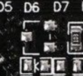

# SAMD21 M0-Mini (branded Wemos)
Notes on using the Chinese "SAMD21 M0-Mini" board. I've seen the brandings Wemos and RobotDyn.

## Hardware:

This board in the "nano" sizing has an Atmel/MicroChip SAMD21G18 MCU, 32K ram, 256K flash, and is advertised as "Arduino Zero" compatible.

In hardware, the Arduino's user LED on D13/PA17 is not fitted, although the PCB design seems to have intended it. A schematic image is attached above, amended to be as accurate as I believe. 

There are still 3 LEDs fitted, a power Led and a TX and RX Led. The Rx and Tx ones are toggled (__in software__) when TX or RX data is happening. The arduino bootloader includes driver code to do this winking. Whether your application similarly drives these 2 Leds, "depends...". More on that below.

Another missing hardware connection is MCU pins PB22 and PB23, which on the full-size real Arduino Zero are connected to onboard debug hardware.  

The obvious application types available are 
 - arduino sketch
 - circuitpython
 - manually set up toolchain with compiler & uploader

This set of notes looks at the first two of these. If you are doing your own suite, you are smart enough to not need these notes!

## Bootloader:

From the factory, the MCU chip's ROM-based bootloader seems to support writing to flash only by ICE/SWD/Jlink. For hobby or low level use, flashing every sketch or program solely that way, on a tiny non-hobby connector, is in the "too much trouble" basket. Therefore a flash-based secondary bootloader is usually installed once, hopefuly by the board manufacturer, and left alone thereafter. The flash-based bootloader should offer easier ways to reflash your software.

On the board as supplied, a bootloader __is__ installed in flash. It's an "arduino-zero compatible" board, so the arduino-SAMD bootloader is included. This allows programming your sketch by the USB port, and the Arduino IDE has drivers for that built in. Serial/bossac on either USB or UART TX/RX pins???

But there is an alternative Adafruit bootloader more cleanly matched to Adafruit's circuitPython. The Adafruit UF2 flash bootloader allows an additional mode of reflashing, by simple file copy or drag to a flash drive.

Need more info (I'm suggesting you __don't__) on getting these two bootloaders?
 - https://github.com/arduino/ArduinoCore-samd/tree/master/bootloaders/zero
 - https://cdn-learn.adafruit.com/downloads/pdf/compiling-m0-atsamd21-bootloader.pdf 
 
 
 - https://learn.adafruit.com/adafruit-trinket-m0-circuitpython-arduino/uf2-bootloader-details
 - https://github.com/adafruit/uf2-samdx1  
 - https://github.com/adafruit/uf2-samdx1/releases/tag/v2.0.0-adafruit.7 

So far I have resisted touching the supplied bootloader, as even circuitPython can be managed, as we see below, while leaving the arduino bootloader there. 

## Arduino IDE:

You must install the SAMD support from Tools/Board/Boards Manager, selecting "Arduino SAMD Boards (32-bits Arm Cortex-M0+) by Arduino."

Then actually select the board: Tools/Board = Arduino SAMD / "Arduino Zero (Native USB Port)".  

Hello World: Load up the standard Basic/Blink example sketch. Add a line like this   
```    #define LED_BUILTIN 25  ```   
Compile. Double-click the board reset button. Upload. See if a LED blinks.

Let's explain a bit:  

1. The Arduino bootloader uses double click on reset button to enter flash upload mode. Single reset enters normal running mode. (Boot0/1 jumpers, like STM32 uses, are not used on the SAMD.) 

2. The serial/bossac mode of USB upload is included in the Arduino install. 

3. The regular user LED is missing. So we choose one of the TX/RX LEDs. For the moment, the Arduino sketch is NOT otherwise driving these as TX/RX indicators (see above), so we can re-employ them.

4. But what pin or GPIO number? For this board, reference the pins as 0-26 or A0-A5.  Not D25, nor PB03 or PB3.    
0  PA11 UART-RX    
1  PA10 UART-TX        
2  PA14        
3  PA09        
4  PA08        
5  PA15        
6  PA20        
7  PA21        
8  PA06        
9  PA07        
10 PA18         
11 PA16         
12 PA19       
13 PA17       
A0  PA02       
A1  PB08        
A2  PB09        
A3  PA04       
A4  PA05       
A5  PB02       
20 PA22 SDA     
21 PA23 SCL            
22 PA12 MISO ICSP      
23 PB10 MOSI ICSP   
24 PB11 SCK  ICSP      
25 PB03 LED1               
26 PA27 LED2     

(To be checked: I suspect there might be a numbering issue on pins of ICSP connector. I haven't worked out why there is a ICSP connector on this board anyway, exc to give access to spare MCU SPI pins. I'm missing something?)

If you want to use Arduino's terminal (ie serial via the USB connector), it's done like this:
```
void setup() {
  SerialUSB.begin(9600);  // the baudrate is ignored
}
void loop() {
  delay(1000);
  SerialUSB.println("Test SerialUSB");
)
```
SerialUSB does seem to automatically use the LEDs as TX/RX indicators. But we can still apparently get access and control the LEDs ourself. I haven't looked closely at how these might interact! 

There is also a "Serial1" connection available like this, using a 3V TTL uart adapter (eg CP2102) at pins D0/D1:
```
void setup() {
  Serial1.begin(9600);  
}
void loop() {
  delay(1000);
  Serial1.println("Test Serial1");
)
```
The regular "Serial" exists in software, but its pins PB22/PB23 are not available to us.


## Adafruit's CircuitPython:

CircuitPython is Adafruit's fork/variant of the MicroPython project for the SAMD MCUs. (Use MicroPython on STM32 boards, and CircuitPython on SAMD boards.)  

https://circuitpython.readthedocs.io/en/3.x/docs/index.html   

CircuitPython is supplied as a binary file that needs flashing once. Thereafter your ".py" scripts are loaded a different way. Therefore, the following once-off manual install of the binary of CircuitPython can, like a childbirth, be later forgotten.

If we had Adafruit's bootloader, we could double-click reset, see a BOOT drive appear on our PC, and drag the "firmware.dfu" of the circuitpython to the BOOT drive. Installed! 

But we have the arduino bootloader. Dragging a .dfu isn't available, but bossac, the serial transfer utility, is hidden away inside our Arduino IDE package. We can manually use that to flash the CircuitPython. We just need the ".bin" version of firmware not the usual ".dfu" format.  

Reference:  https://learn.adafruit.com/welcome-to-circuitpython/non-uf2-installation   
Don't believe the advice that you need to install bossac. We already have it! (Somewhere!)  
And here is where I got the .bin image:  https://github.com/adafruit/circuitpython/releases/tag/3.1.1

I have Linux Mint. Here is how I flashed:    
Double-click Reset.    
```/opt/arduino-1.8.7/portable/packages/arduino/tools/bossac/1.7.0/bossac -i -d -e -w -v /home/brian/Documents/Bots/Cortex-M-STM32-SAMD/SAMD21-M0-Mini/adafruit-circuitpython-arduino_zero-3.1.1.bin -R```    
In summary, this is just   
```bossac  (some options)  firmware.bin -R```    

1. I deduced the full command and options by setting arduino to Preferences/Verbose during Upload, and doing a test sketch upload!  And by reading the help out of bossac.
2. Note where I found my bossac utility in my Arduino install.  Use your own full path for your bossac.   
3. Note the exact firmware ".bin" file I fetched from Adafruit and stowed on my PC. It's simply the arduino zero bin version.
4. The -R at the end simply resets the MCU into run mode, without reset button.
5. I let bossac auto-find its com port.

I did it all again on Windows10. It looked like this:    
```C:\Users\Brian\Appdata\Local\Arduino15\packages\arduino\tools\bossac\1.7.0\bossac.exe -i -d -e -w -v adafruit-circuitpython-arduino_zero-3.1.1.bin -R```

Wow. This board now thinks it's an arduino zero running circuitpython. __A CIRCUITPY drive appears__ at my PC. If I edit or drag a "main.py" file there, it will run.

Run a serial terminal on the PC. I use GTKTerm. The port for me was /dev/ttyACM0. Any baudrate. Hit enter, and __the python interpreter prompt appears__. Let's do some testing preparatory to making a simple "blink" script:
```
import board, microcontroller, digitalio
help(board)
help(microcontroller.pin)

led1 = digitalio.DigitalInOut(microcontroller.pin.PB03)
```
FAIL. We can see the microcontroller.pin.PB03 and PA27 of the 2 LEDs. But we can't access them. CircuitPython has them reserved as the winking TX/RX indicators. That's unfortunate. We now have no user LEDs available at all.   

With that restriction, we have Arduino Zero CircuitPython all up and running.

Ever want to return to Arduino? Easy. you can jump from Arduino IDE to CircuitPython as often as you wish.

## Recompiling CircuitPython:

OK, so if we want to tweak our CircuitPython package so the two LEDs are back under our control. Is it worth the effort?

It's actually not too difficult. Just a bit tech-y. My first attempt on my Debian Mint PC had a toolchain clash with stuff I had already (MicroPython recompiling!). So in short order, I fetched the ISO for Ubunto 18.04 and set it up as a VM in Virtualbox. A new clean OS.

The detailed instructions from Adafruit are here: https://learn.adafruit.com/building-circuitpython, and my steps were:

```
sudo apt update
sudo apt install build-essential, git, gettext
sudo add-apt-repository ppa:team-gcc-arm-embedded/ppa
sudo apt update
sudo apt install gcc-arm-embedded
git clone https://github.com/adafruit/circuitpython.git
cd circuitpython
git checkout 3.x
git submodule sync
git submodule update --init –recursive
make -C mpy-cross
cd ports/atmel-samd
make BOARD=arduino_zero
```
Success. The rebuilt (unchanged) Arduino Zero binary was in .../circuitpython/ports/atmel-samd/__build-arduino_mini/firmware.bin__, and with the similar bossac call as above it flashed to the board OK.

This was all rather painless. The hardest step was transferring the firmware.bin file back to my usual linux desktop for flashing!

Now, to fork the arduino_mini board into a new one. I duplicated the folder ../ports/atmel-samd/boards/__arduino_zero__ into __new__ ../ports/atmel-samd/boards/__samd21_mini__   
The 4 files in there I modified slightly to:  
 - remove CircuitPython's TX/RX indicator use of those 2 LEDs
 - give the 2 LEDs names: board.LED1 and board.LED2
 - rename as Samd21 Mini instead of Arduino Zero  
 
My version of these 4 files is available above. (So, for you, just copy that folder into place inside .../boards.) Positioned as before in .../ports/atmel-samd I compiled the new version:  
``` make samd21_mini ```    
The new firmware.bin in .../build-samd21_mini can be flashed using bossac as before. 

But you don't really need to recompile again. __I have placed a copy of the "samd21_mini" build above.__ It's still simply called firmware.bin.

Start up the board and your serial terminal to talk with it, as before.  CTRL-C / Enter, or perhaps just Enter. See the list of pin named like this:  
```
Press any key to enter the REPL. Use CTRL-D to reload.
Adafruit CircuitPython 3.1.1-7-g3ace9ea9e-dirty on 2018-12-19; Samd21 Mini with samd21g18
>>> 
>>> import board
>>> help(board)
  A0 -- board.A0
  A1 -- board.A1
  A2 -- board.A2
  (etc)
  D5 -- board.D5
  D6 -- board.D6
  (etc)
  LED1 -- board.LED1
  LED2 -- board.LED2
>>> 
>>> 
```   
We now know how to address our pins. This agrees well with the pin labels on the hardware.

Hello World: In the drive CIRCUITPY create this main.py:
```
import time, digitalio, microcontroller, board
led1 = digitalio.DigitalInOut(board.LED1)
# led1 = digitalio.DigitalInOut(microcontroller.pin.PB03) # THIS WOULD WORK TOO
led1.direction = digitalio.Direction.OUTPUT
led1.value = True
led2 = digitalio.DigitalInOut(board.LED2)
# led2 = digitalio.DigitalInOut(microcontroller.pin.PA27)
led2.direction = digitalio.Direction.OUTPUT
led2.value = False
while 1:
    led1.value = not led1.value
    time.sleep(1)
    led2.value = not led2.value
    time.sleep(1)

```   
We should have 2 blinking LEDs.

## Related:

For my notes on the STM32F407VG with micropython, see https://github.com/BLavery/STM32F407VG-Micropython  
For my notes on the STM32F407VG with Arduino, see https://github.com/BLavery/STM32F407VG-Arduino  
For my notes on the STM32F030F4P6, see https://github.com/BLavery/STM32F030F4P6-Arduino  
For my notes on the STM32F103 "BluePill", see https://github.com/BLavery/STM32F103-Arduino  


